<p align="center">
  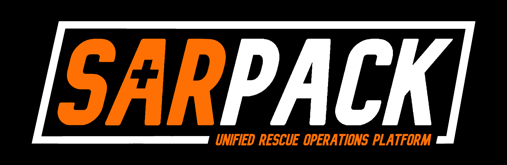
</p>

---

SARPack is a unified rescue operations platform built for a volunteer search and rescue organization operating in Pennsylvania. It manages the full lifecycle of a rescue operation — from personnel deployment and real-time field tracking to automated ICS form generation and agency submission — across simultaneous incidents in any environment, including areas with zero cell coverage.

Designed to work when lives depend on it.

---

## The five apps

| App | Role | Status |
|---|---|---|
| **BASECAMP** | Incident command dashboard — map, deployments, real-time field ops | ✅ COMPLETE |
| **LOGBOOK** | Auto-generates ICS forms from live incident data, IC sign-off, agency export | ✅ COMPLETE |
| **WARDEN** | Personnel admin — certifications, equipment, scheduling, deployment history | ✅ COMPLETE |
| **TRAILHEAD** | Offline mobile PWA carried by every field operator | ✅ COMPLETE |
| **RELAY** | Radio + Meshtastic bridge, plots GPS positions from field radios | ⏸ DEFERRED — Hardware Required |

---

## Screenshots

### BASECAMP

<p align="center">
  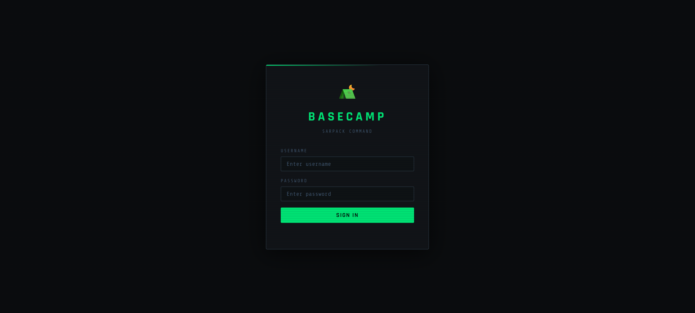
</p>
<p align="center">
  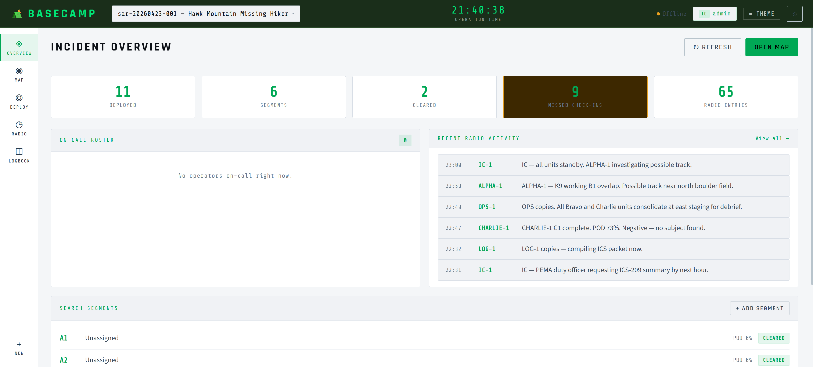
</p>
<p align="center">
  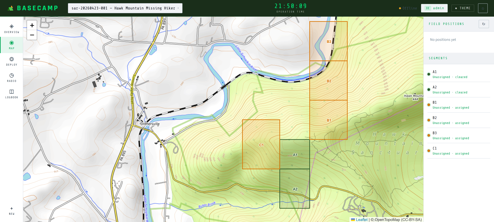
</p>

### LOGBOOK

<p align="center">
  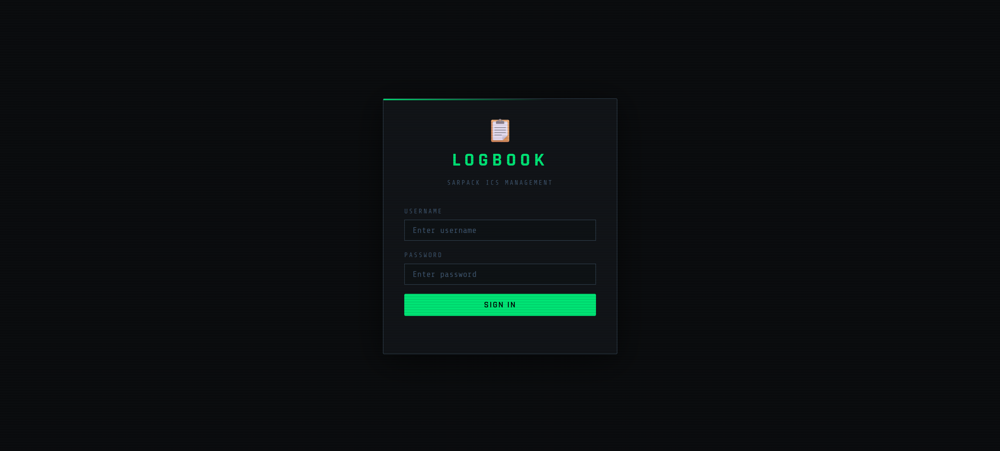
</p>
<p align="center">
  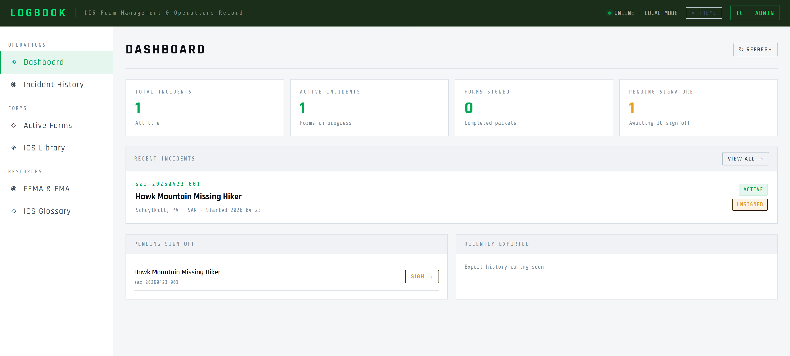
</p>
<p align="center">
  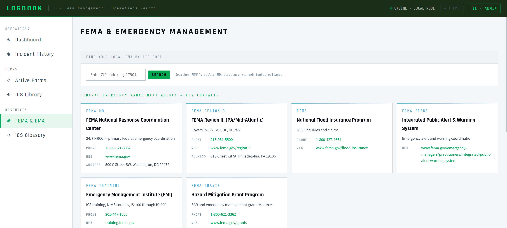
</p>

### WARDEN

<p align="center">
  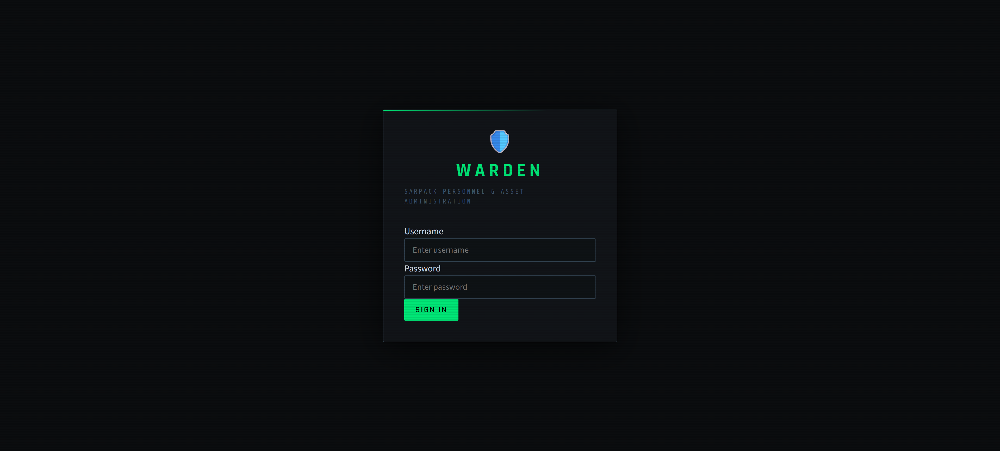
</p>
<p align="center">
  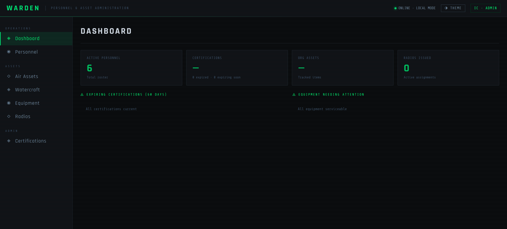
</p>
<p align="center">
  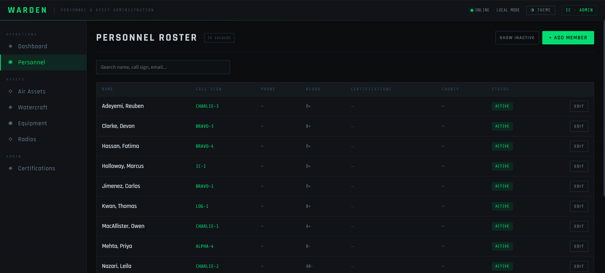
</p>

### TRAILHEAD

<p align="center">
  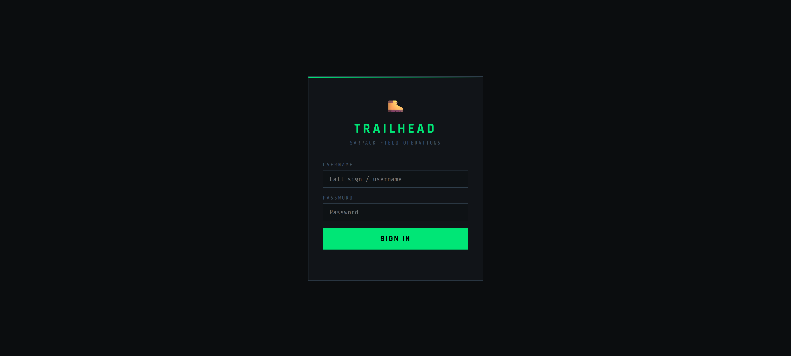
</p>
<p align="center">
  
</p>
<p align="center">
  
</p>
<p align="center">
  
</p>
<p align="center">
  
</p>

---

## Architecture

SARPack is a hybrid local-first system. All five apps share a single SQLite database on a ruggedized Toughbook deployed at base of operations. When connectivity is available, data syncs to a PostgreSQL cloud database. Operations continue without interruption if the connection drops.

```
Field layer      TRAILHEAD (offline PWA) · RELAY (Meshtastic bridge)
↓ sync on signal
Command layer                  BASECAMP
↓
Data layer        sarpack.db (SQLite) ←→ PostgreSQL (cloud)
↓
Reporting layer              LOGBOOK
↓
Security layer       ADS (Arcane Defense Suite)
```

- **Local-first** — every write goes to SQLite instantly, no network required
- **Outbox sync pattern** — pending writes queue and replay to the cloud automatically on reconnect
- **Optimistic locking** — version numbers on every record prevent silent data conflicts during multi-user edits
- **Incident-scoped data** — every table keys to an `incident_id`, enabling simultaneous active incidents with zero data bleed between them

---

## ICS form generation

LOGBOOK auto-compiles all eight ICS forms directly from live BASECAMP data. No manual data entry — the compiler queries the database and maps every structured field to the official FEMA layout automatically.

| Form | Auto-populated from |
|---|---|
| ICS-201 Incident Briefing | `incidents` — name, commander, coordinates, start time |
| ICS-204 Assignment List | `deployments` — teams, roles, divisions |
| ICS-205 Radio Plan | `radio_log` — channels, assignments |
| ICS-206 Medical Plan | `certifications` — WFR, EMT, Paramedic personnel |
| ICS-209 Status Summary | `incidents` + `deployments` — personnel counts, phase |
| ICS-211 Check-In List | `deployments` — full roster with check-in/out times |
| ICS-214 Activity Log | `radio_log` — timestamped entries per operator |
| ICS-215 Operational Planning | `search_segments` — divisions, tactical objectives |

Narrative fields are completed by the IC. A compliance validator flags missing required fields before the sign-off screen is reachable. The Incident Commander must digitally sign before any form can be exported. Signed forms are immutable — amendments create a new version.

---

## Role system

| Role | Access |
|---|---|
| `IC` — Incident Commander | Full control, only role that can sign and export ICS forms |
| `ops_chief` — Operations Section Chief | Manages divisions, teams, search segments |
| `logistics` — Logistics / Admin | WARDEN access, resource management |
| `field_op` — Field Operator | TRAILHEAD only, no BASECAMP access |
| `observer` | BASECAMP read-only, no writes |

---

## Project status

| Phase | Deliverable | Status |
|---|---|---|
| Phase 0 | Shared DB module, auth, sync engine, migrations, launcher | ✅ Complete |
| Phase 1 | WARDEN — personnel, certifications, equipment | ✅ Complete |
| Phase 2 | BASECAMP — incident command, map, deployments | ✅ Complete |
| Phase 3 | LOGBOOK — ICS form generation and export | ✅ Complete |
| Phase 3 | RELAY — Meshtastic radio bridge | ⏸ Deferred — Hardware Required |
| Phase 4 | TRAILHEAD — offline mobile PWA | ✅ Complete |
| Phase 5 | ADS integration, tabletop test, production deploy | Planned |

---

## Getting started

**Requirements:** Python 3.10+, pip
```cmd
git clone https://github.com/JMitchTech/SARPack.git
cd SARPack
pip install -r requirements.txt
copy .env.template .env
```

Generate a secret key and add it to `.env`:
```cmd
python -c "import secrets; print(secrets.token_hex(32))"
```

Initialize the database:
```cmd
python -c "from core import initialize; initialize()"
```

Launch from the system tray:
```cmd
python sarpack.py
```

---

## Tech stack

<p align="center">
  
  
  
  
  
  
  
</p>

---

## Security

SARPack is monitored in production by the [Arcane Defense Suite](https://github.com/JMitchTech/ARCANE-Defense-Suite) — a custom-built cybersecurity platform providing network scanning, log analysis, honeypot detection, and SIEM correlation.

---

<p align="center">
  <sub>Built by <a href="https://github.com/JMitchTech">JMitchTech</a> · Part of the Wizardwerks Enterprise Labs ecosystem</sub>
</p>
