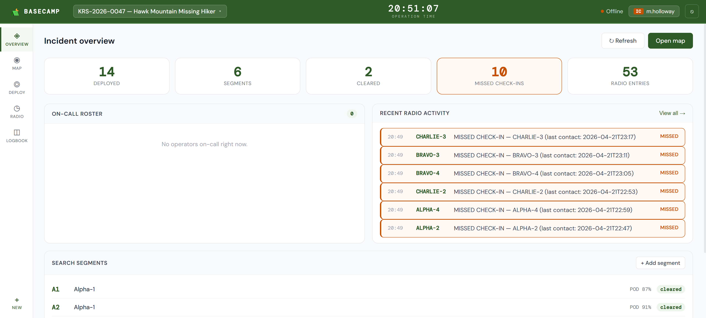
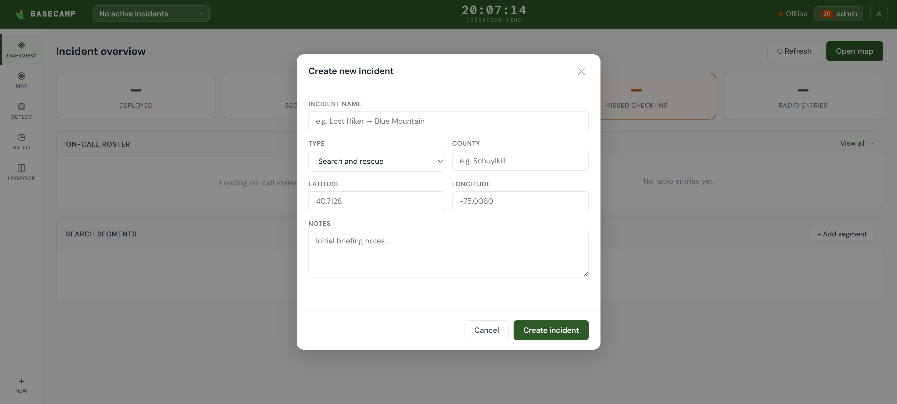
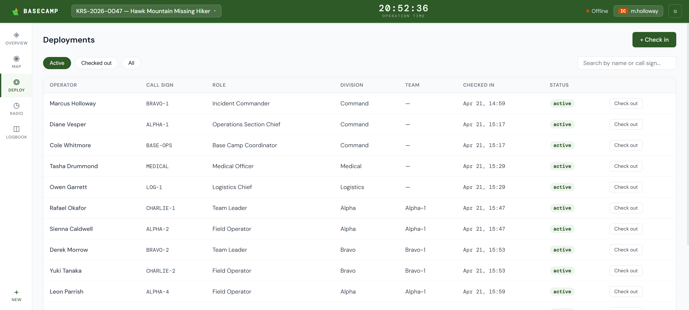
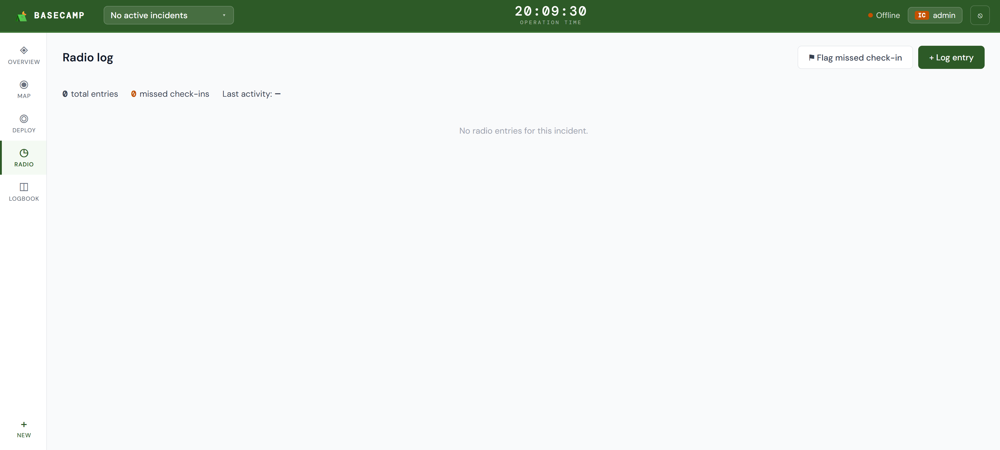
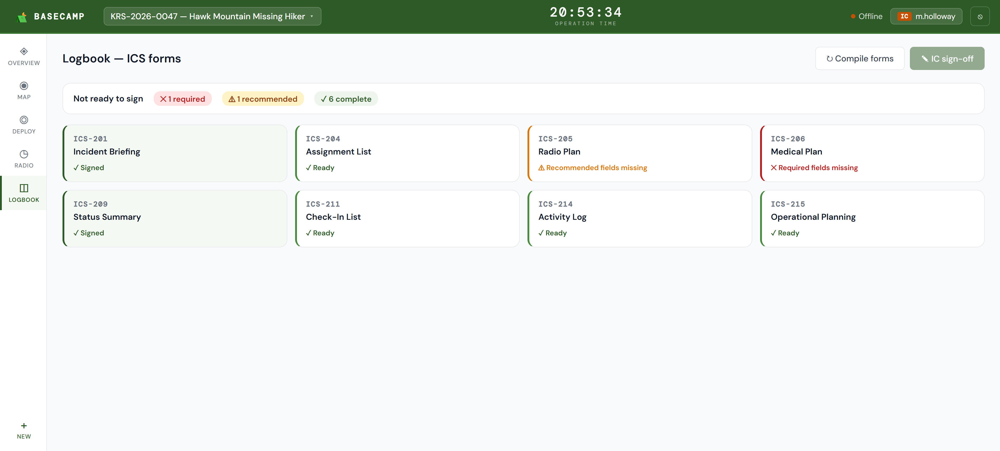

<p align="center">
  
</p>

# BASECAMP

BASECAMP is the incident command dashboard for SARPack. It is the operational nerve center deployed at the base of operations during a rescue — giving the Incident Commander and operations staff a live view of every active incident, every deployed team member, and every radio transmission, all from a single interface.

It is one of five apps in the SARPack platform. All five share a single SQLite database on a ruggedized Toughbook. BASECAMP runs on port `8000` by default.

---

## Screenshots

### Login

<p align="center">
  
</p>

The login screen authenticates users against the SARPack role system. Access to BASECAMP requires one of the following roles: `IC`, `ops_chief`, `logistics`, or `observer`. Field operators (`field_op`) are TRAILHEAD-only and cannot access BASECAMP. Sessions expire after a configurable window (default 12 hours).

---

### Dashboard

<p align="center">
  
</p>

The main dashboard is the first screen after login. It displays all active incidents with real-time stats — deployed personnel count, active team count, last radio contact, and missed check-in flags. System-wide totals across all active incidents are shown at the top: total deployed personnel, assigned search segments, and cleared segments. The dashboard is the primary landing view and the jumping-off point for every other tab.

---

### New Incident

<p align="center">
  
</p>

The new incident window is IC-only. It creates a new incident record that scopes all subsequent data — deployments, GPS tracks, radio logs, search segments, and ICS forms — to that incident. Fields include incident name, type (`sar`, `disaster_relief`, `training`, `standby`, `other`), county, state, coordinates, and Incident Commander assignment. Multiple incidents can be active simultaneously with zero data bleed between them.

---

### Map

<p align="center">
  
</p>

The map tab displays live GPS positions for all deployed personnel on a Leaflet.js map. Positions update every 10 seconds and on real-time SocketIO push events from RELAY. Individual operator tracks (full GPS trail) can be rendered on demand. Search segments are drawn as polygons with color-coded status — unassigned, assigned, cleared, or suspended. Segment assignment and status changes are managed directly from the map. GPS tracks are append-only and never modified after being written.

---

### Deployments

<p align="center">
  
</p>

The deployments tab manages the full personnel roster for an incident. It handles check-in and check-out, role assignment, division and team grouping, and displays each operator's certifications (WFR, EMT, Paramedic, etc.) and emergency contact information. Every deployment record feeds directly into LOGBOOK — check-in timestamps populate the ICS-211 check-in list, and role/division assignments populate the ICS-204 assignment list.

---

### Radio Log

<p align="center">
  
</p>

The radio log tab is a chronological, append-only record of all radio communications for the incident. Entries are linked to call signs and personnel records. Missed check-ins are flagged automatically and broadcast immediately via SocketIO so the IC is alerted in real time. The full log feeds into LOGBOOK as the ICS-214 activity log. No radio entries can be edited or deleted — the log is a permanent record.

---

### Logbook

<p align="center">
  
</p>

The logbook tab surfaces the LOGBOOK app from within BASECAMP. It provides access to ICS form generation and history for the active incident. LOGBOOK compiles all eight ICS forms directly from live BASECAMP data — no manual data entry. The Incident Commander must digitally sign before any form can be exported. Signed forms are immutable; amendments create a new versioned record.

---

## Running BASECAMP

From the SARPack root directory:

```cmd
python -m basecamp.app
```

BASECAMP runs on port `8000` by default (set `PORT_BASECAMP` in `.env` to override). Open `http://localhost:8000` in your browser.

To launch all SARPack apps together via the system tray launcher:

```cmd
python sarpack.py
```

---

## Role access

| Role | BASECAMP Access |
|---|---|
| `IC` | Full access — create/close incidents, sign and export ICS forms |
| `ops_chief` | Full access — manage divisions, segments, deployments |
| `logistics` | Full access — check-in/out, resource management |
| `observer` | Read-only — no writes |
| `field_op` | No access — TRAILHEAD only |

---

## API endpoints

BASECAMP exposes a REST API used by the frontend. All endpoints require authentication.

| Prefix | Description |
|---|---|
| `/api/incidents` | Incident lifecycle — create, update, close |
| `/api/deployments` | Personnel check-in/out, role and division assignment |
| `/api/map` | GPS positions, operator tracks, search segment management |
| `/api/radio` | Radio log entries, missed check-in queries |
| `/api/dashboard` | Aggregated stats for the dashboard overview |
| `/api/forms` | ICS form generation via LOGBOOK |
| `/api/users` | User account management (IC only) |
| `/api/personnel` | Personnel roster from WARDEN |
| `/api/certifications` | Certification records from WARDEN |

A `/health` endpoint returns current app status, mode, and sync state.

---

## Real-time events

BASECAMP uses Flask-SocketIO for real-time push updates. Events are broadcast to all connected clients when GPS positions update, missed check-ins are flagged, deployment status changes, or incidents are modified. The frontend subscribes to these events and updates the map and dashboard without polling.

---

<p align="center">
  <sub>Part of <a href="https://github.com/JMitchTech/SARPack">SARPack</a> · Built by <a href="https://github.com/JMitchTech">JMitchTech</a> · Wizardwerks Enterprise Labs</sub>
</p>
