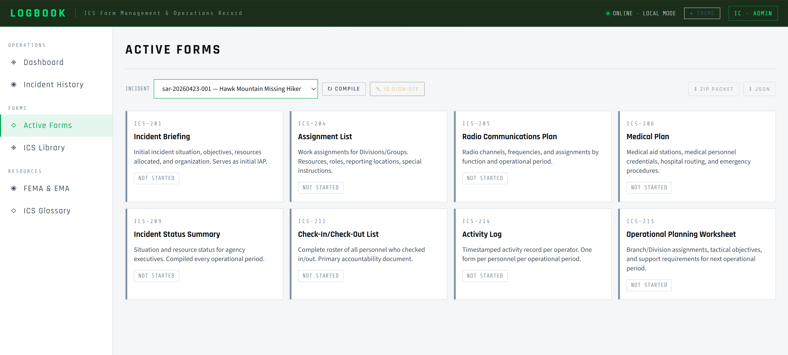
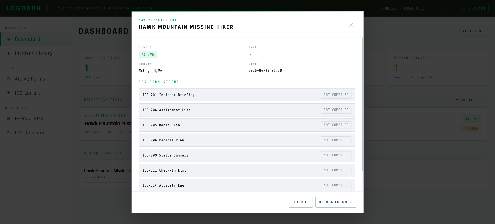
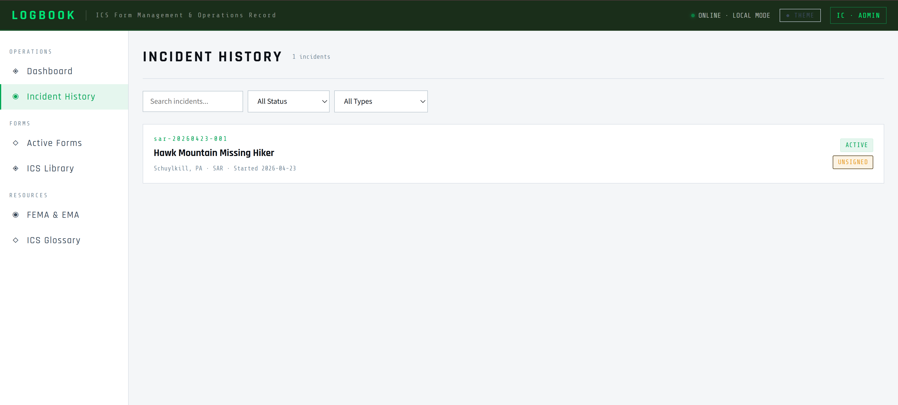
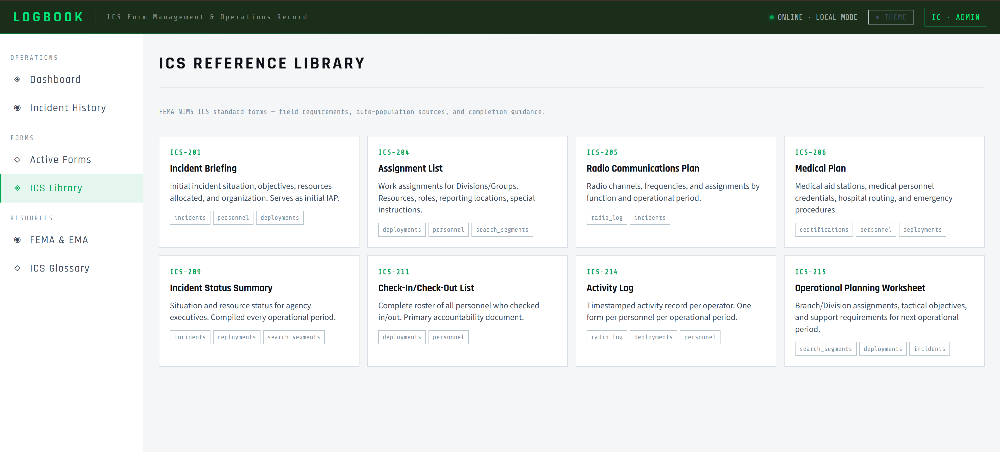
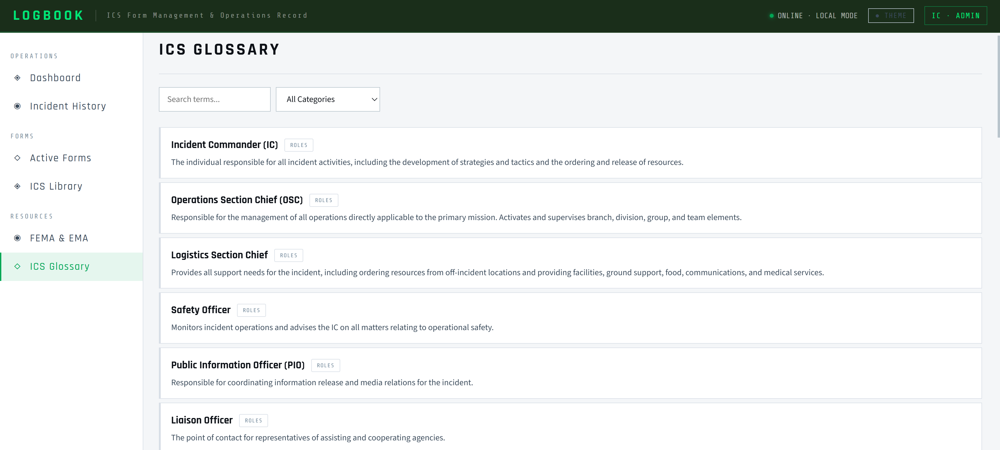

<p align="center">
  
</p>

# LOGBOOK ✅ COMPLETE

LOGBOOK is the ICS form generation engine for SARPack. It auto-compiles all eight standard ICS forms directly from live incident data in the SARPack database — no manual data entry required. Forms are validated for FEMA compliance, signed off digitally by the Incident Commander, and exported for agency submission.

It is one of five apps in the SARPack platform. All five share a single SQLite database on a ruggedized Toughbook. LOGBOOK runs on port `8002` by default and is also accessible as the Logbook tab inside BASECAMP.

---

## Screenshots

### Login

<p align="center">
  
</p>

LOGBOOK uses the same SARPack role system as BASECAMP. Only the `IC` role can sign and export completed forms. Other roles can view form status and history.

---

### Dashboard

<p align="center">
  
</p>

The dashboard shows all ICS form sets for every incident, with their current status — draft, pending IC signature, signed, or exported. The IC can initiate compilation for any active incident from this view.

---

### Active Forms

<p align="center">
  
</p>

The active forms view displays the compilation state of all eight ICS forms for the current incident. Each form shows its auto-populated field count, any fields flagged as incomplete by the validator, and whether IC narrative fields have been filled in. The sign-off button is not reachable until the validator clears all required fields.

---

### ICS Form — FEMA Layout

<p align="center">
  
</p>

Compiled forms render in the official FEMA layout. Every structured field — incident name, commander, personnel roster, radio assignments, search segments — is pulled directly from the database. Narrative fields are editable inline by the IC before sign-off. Once signed, the rendered form is locked and any amendment creates a new versioned record.

---

### Incident Popup

<p align="center">
  
</p>

When multiple incidents are active simultaneously, the incident popup allows the IC or operator to select which incident's forms to view or compile. Each incident's form set is fully isolated — no data bleed between incidents.

---

### Form History

<p align="center">
  
</p>

The history view shows every signed form export for a given incident, with timestamps and IC signature metadata. Signed forms are immutable. If a correction is needed after sign-off, the history view shows the amendment chain — each amendment creates a new versioned record linked to the original.

---

### Form Library

<p align="center">
  
</p>

The form library provides reference documentation for all eight ICS forms, including field-by-field descriptions of what each entry means and what SARPack data source populates it.

---

### ICS Glossary

<p align="center">
  
</p>

The built-in ICS glossary covers standard terminology, role definitions, and operational period concepts — a quick reference for operators who may be less familiar with formal ICS documentation requirements.

---

## ICS forms compiled

| Form | Auto-populated from |
|---|---|
| ICS-201 Incident Briefing | `incidents` — name, commander, coordinates, start time |
| ICS-204 Assignment List | `deployments` — teams, roles, divisions |
| ICS-205 Radio Plan | `radio_log` — channels, assignments |
| ICS-206 Medical Plan | `certifications` — WFR, EMT, Paramedic personnel |
| ICS-209 Status Summary | `incidents` + `deployments` — personnel counts, phase |
| ICS-211 Check-In List | `deployments` — full roster with check-in/out times |
| ICS-214 Activity Log | `radio_log` — timestamped entries per operator |
| ICS-215 Operational Planning | `search_segments` — divisions, tactical objectives |

---

## Running LOGBOOK

From the SARPack root directory:

```cmd
python -m logbook.app
```

LOGBOOK runs on port `8002` by default (set `PORT_LOGBOOK` in `.env` to override). Open `http://localhost:8002` in your browser.

To launch all SARPack apps together via the system tray launcher:

```cmd
python sarpack.py
```

---

## Role access

| Role | LOGBOOK Access |
|---|---|
| `IC` | Full access — compile, fill narratives, sign, and export forms |
| `ops_chief` | View forms and compilation status |
| `logistics` | View forms and compilation status |
| `observer` | View signed/exported forms only |
| `field_op` | No access |

---

## API endpoints

| Prefix | Description |
|---|---|
| `/api/forms` | Form compilation, status, sign-off, and export |
| `/api/forms/history` | Signed form history and amendment records |

---

<p align="center">
  <sub>Part of <a href="https://github.com/JMitchTech/SARPack">SARPack</a> · Built by <a href="https://github.com/JMitchTech">JMitchTech</a> · Wizardwerks Enterprise Labs</sub>
</p>
