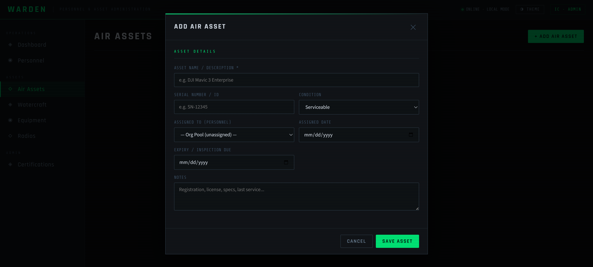
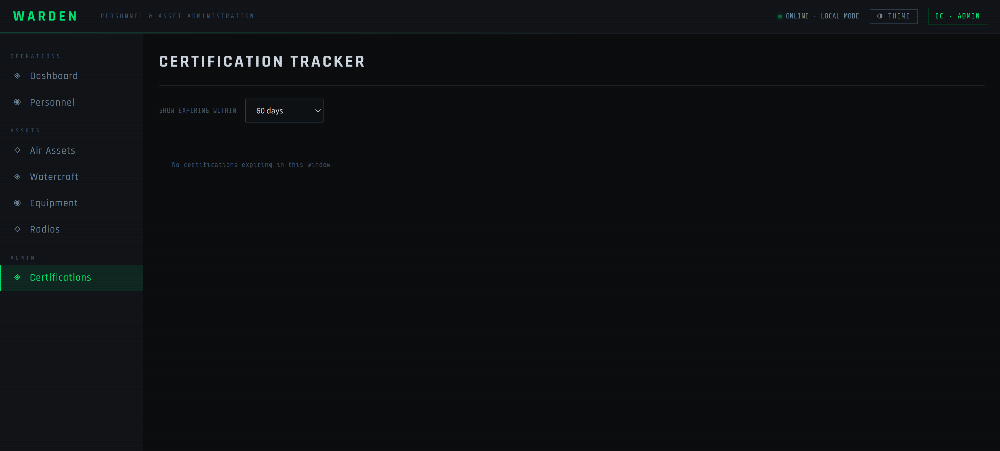
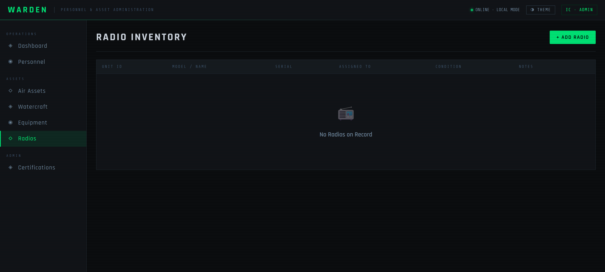
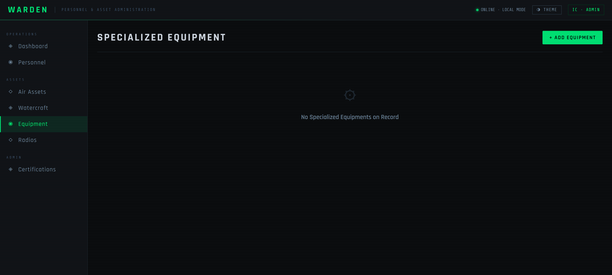
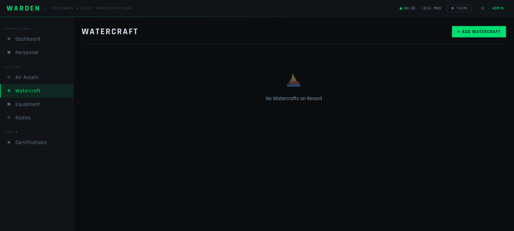
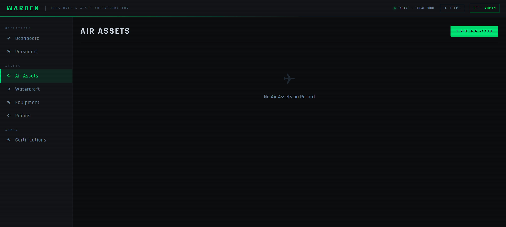

<p align="center">
  
</p>

# WARDEN ✅ COMPLETE

WARDEN is the personnel administration portal for SARPack. It manages every member of the rescue organization — their certifications, equipment assignments, shift schedules, deployment history, and user accounts. WARDEN is the source of truth for who is qualified, what they're carrying, and when they're available.

It is one of five apps in the SARPack platform. All five share a single SQLite database on a ruggedized Toughbook. WARDEN runs on port `8001` by default.

---

## Screenshots

### Login

<p align="center">
  
</p>

WARDEN uses the same SARPack role system as BASECAMP. Full personnel management is available to the `IC` and `logistics` roles. The `ops_chief` role has read access to certifications and equipment for deployment planning.

---

### Dashboard

<p align="center">
  
</p>

The dashboard gives a quick summary of the organization's active personnel — total roster size, certification breakdown, equipment counts, and upcoming certification expirations. It's the starting point for any administrative task.

---

### Roster

<p align="center">
  
</p>

The roster view displays all personnel records. Each record includes contact information, active certifications, current equipment assignments, and deployment history. Records can be searched, filtered by certification or role, and sorted by name or availability status.

---

### Add Asset

<p align="center">
  
</p>

The add asset form creates new equipment records and assigns them to personnel. Assets are categorized by type — radio, medical kit, technical rescue gear, watercraft, aircraft, or other — and linked to a responsible member. Assignment history is retained for accountability.

---

### Certifications

<p align="center">
  
</p>

The certifications tab tracks every member's credentials — WFR, EMT, Paramedic, swift water, rope rescue, and more. Expiration dates are monitored and surface in the dashboard as upcoming expirations. BASECAMP and LOGBOOK pull from this table when populating the ICS-206 Medical Plan.

---

### Radios

<p align="center">
  
</p>

The radios view manages the organization's radio inventory — make, model, frequency capability, and current assignment. Radio assignments feed into the ICS-205 Radio Plan in LOGBOOK.

---

### Specialized Equipment

<p align="center">
  
</p>

The specialized equipment tab covers technical rescue gear — rope systems, litters, extraction tools, and other mission-critical assets that require tracked assignment and inspection records.

---

### Watercraft

<p align="center">
  
</p>

The watercraft tab tracks boats and water rescue assets, including certification requirements for operators, registration status, and current assignment to personnel or incidents.

---

### Air Assets

<p align="center">
  
</p>

The air assets tab manages aerial resources — helicopters, drones, and fixed-wing aircraft — including operator certifications, availability status, and contact information for coordinating agencies.

---

## Running WARDEN

From the SARPack root directory:

```cmd
python -m warden.app
```

WARDEN runs on port `8001` by default (set `PORT_WARDEN` in `.env` to override). Open `http://localhost:8001` in your browser.

To launch all SARPack apps together via the system tray launcher:

```cmd
python sarpack.py
```

---

## Role access

| Role | WARDEN Access |
|---|---|
| `IC` | Full access — manage all personnel, equipment, certifications, and user accounts |
| `logistics` | Full access — personnel, certifications, equipment, scheduling |
| `ops_chief` | Read-only — certifications and equipment for deployment planning |
| `observer` | No access |
| `field_op` | No access |

---

## API endpoints

| Prefix | Description |
|---|---|
| `/api/personnel` | Personnel records — create, update, deactivate |
| `/api/certifications` | Certification records — add, update, expiration tracking |
| `/api/equipment` | Equipment inventory — assign, unassign, inspection records |
| `/api/schedules` | Shift scheduling and availability |
| `/api/users` | SARPack user account management |

---

<p align="center">
  <sub>Part of <a href="https://github.com/JMitchTech/SARPack">SARPack</a> · Built by <a href="https://github.com/JMitchTech">JMitchTech</a> · Wizardwerks Enterprise Labs</sub>
</p>
